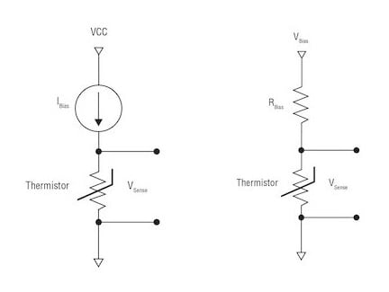

# Create Lookup Tables Using Compile-Time Expressions
---
# Compiler-Driven Lookup Table Generation
The Old Way
```c++
const float TemperatureFromThermistor[] = { 25.0, 26.2, 27.5, ...      };
//                                     ADC=   0 ,   1 ,   2 , ...  255 // 
```
* Generate via spreadsheet and copy and paste
* Generate via script and copy and paste
* Generate via script and incorporate into build system
Notes: Where does this table come from?  It must be maintained separately via spreadsheet or script.  Often, we change component values which necessitates re-creating lookup tables.  What if we check in a source code change and recompile, and it is all taken care of?
---
# Compiler-Driven Lookup Table Generation
Some considerations
* Constants in embedded system must be carefully crafted to end up (usually) in the `.rodata` section
    * this results in constants being placed in flash - and not copied to RAM
---
# Compiler-Driven Lookup Table Generation
Some considerations
* It is common for hardware and firmware to have to evolve together
    * example: changing resistor values to tune the performance of the system
      </img>
---
# Compiler-Driven Lookup Table Generation
Incorporate governing equations into the code, and let the compiler generate constant tables
* Analog Conversion    
$$ \color{orange} V_{x} = code \cdot \frac{V_{0}}{2^{n}} $$

* Resistor Divider   
$$ \color{orange} R = \frac{V_{x} R_{1}}{V_{0}-V_{x}} $$

* Steinhart-Hart Model (general form)   
$$ \color{orange} \frac{1}{T} = \overset{\infty}{\underset{n=0}{\sum}} a_{n} (\ln(\frac{R}{R_0}))^{n} $$
---
# Compiler-Driven Lookup Table Generation
Table Generation
```c++[1-6|8-14|15-29|30-32|34-43]
constexpr float VoltageFromCode(const float Vref, const size_t n, const uint16_t code)
{
    float V = Vref*code/std::pow(2,n);

    return V;
}

constexpr float ResistanceFromDivider(const float V0, const float V, const float R0)
{
    float R = R0*V0*(V0 - V);

    return R;
}

template<size_t N>
constexpr float ThermistorValue(const std::array<float,N> coefficients, const float R)
{
    float denom = 0.0;
    size_t index = 0;
    for( auto& coeff : coefficients )
    {
        denom += coeff*std::pow(std::log(R), index);
        index += 1;
    }
    float T = 1.0/denom;

    return T;
}

template<size_t N>
constexpr std::array<float,256>
ThermistorTable(std::array<float,N> coeff, const float R0, const float V0, const float Vref)
{
    std::array<float,256> table = {0};

    size_t code = 0;
    for( auto& element : table )
    {
        auto V = VoltageFromCode(Vref, 8, code);
        auto R = ResistanceFromDivider(V0, V, R0);
        element = ThermistorValue(coeff, R);
        code += 1;
    }

    return table;
}
```
---
# Compiler-Driven Lookup Table Generation
Instantiation
```c++
static constexpr std::array<float,4> ThermistorCoefficients { 1.0e-3, 1.0e-4, 1.0e-6, 1.0e-8 };

constexpr auto ThermistorLookup = ThermistorTable(ThermistorCoefficients, 10.0e3, 3.3f, 3.3f);

int main(int , char** )
{

    for( auto element : ThermistorLookup ) std::cout << element << "\r\n";

}
```
---
# Compiler-Driven Lookup Table Generation
```txt[1|22|41|63]
$ readelf --sections --wide main.elf
Section Headers:
  [Nr] Name              Type            Address          Off    Size   ES Flg Lk Inf Al
  [ 0]                   NULL            0000000000000000 000000 000000 00      0   0  0
  [ 1] .interp           PROGBITS        0000000000000318 000318 00001c 00   A  0   0  1
  [ 2] .note.gnu.property NOTE            0000000000000338 000338 000030 00   A  0   0  8
  [ 3] .note.gnu.build-id NOTE            0000000000000368 000368 000024 00   A  0   0  4
  [ 4] .note.ABI-tag     NOTE            000000000000038c 00038c 000020 00   A  0   0  4
  [ 5] .gnu.hash         GNU_HASH        00000000000003b0 0003b0 000028 00   A  6   0  8
  [ 6] .dynsym           DYNSYM          00000000000003d8 0003d8 000120 18   A  7   1  8
  [ 7] .dynstr           STRTAB          00000000000004f8 0004f8 00015f 00   A  0   0  1
  [ 8] .gnu.version      VERSYM          0000000000000658 000658 000018 02   A  6   0  2
  [ 9] .gnu.version_r    VERNEED         0000000000000670 000670 000060 00   A  7   2  8
  [10] .rela.dyn         RELA            00000000000006d0 0006d0 000108 18   A  6   0  8
  [11] .rela.plt         RELA            00000000000007d8 0007d8 000060 18  AI  6  24  8
  [12] .init             PROGBITS        0000000000001000 001000 00001b 00  AX  0   0  4
  [13] .plt              PROGBITS        0000000000001020 001020 000050 10  AX  0   0 16
  [14] .plt.got          PROGBITS        0000000000001070 001070 000010 10  AX  0   0 16
  [15] .plt.sec          PROGBITS        0000000000001080 001080 000040 10  AX  0   0 16
  [16] .text             PROGBITS        00000000000010c0 0010c0 000169 00  AX  0   0 16
  [17] .fini             PROGBITS        000000000000122c 00122c 00000d 00  AX  0   0  4
  [18] .rodata           PROGBITS        0000000000002000 002000 000420 00   A  0   0 32
  [19] .eh_frame_hdr     PROGBITS        0000000000002420 002420 00003c 00   A  0   0  4
  [20] .eh_frame         PROGBITS        0000000000002460 002460 0000d4 00   A  0   0  8
  [21] .init_array       INIT_ARRAY      0000000000003d80 002d80 000010 08  WA  0   0  8
  [22] .fini_array       FINI_ARRAY      0000000000003d90 002d90 000008 08  WA  0   0  8
  [23] .dynamic          DYNAMIC         0000000000003d98 002d98 000200 10  WA  7   0  8
  [24] .got              PROGBITS        0000000000003f98 002f98 000068 08  WA  0   0  8
  [25] .data             PROGBITS        0000000000004000 003000 000008 00  WA  0   0  8
  [26] .bss              NOBITS          0000000000004040 003008 000118 00  WA  0   0 64
  [27] .comment          PROGBITS        0000000000000000 003008 000026 01  MS  0   0  1
  [28] .symtab           SYMTAB          0000000000000000 003030 0003d8 18     29  21  8
  [29] .strtab           STRTAB          0000000000000000 003408 0002dd 00      0   0  1
  [30] .shstrtab         STRTAB          0000000000000000 0036e5 00011a 00      0   0  1
Key to Flags:
  W (write), A (alloc), X (execute), M (merge), S (strings), I (info),
  L (link order), O (extra OS processing required), G (group), T (TLS),
  C (compressed), x (unknown), o (OS specific), E (exclude),
  D (mbind), l (large), p (processor specific)

$ readelf --symbols --wide main.elf
Symbol table '.dynsym' contains 12 entries:
   Num:    Value          Size Type    Bind   Vis      Ndx Name
     0: 0000000000000000     0 NOTYPE  LOCAL  DEFAULT  UND 
     1: 0000000000000000     0 FUNC    GLOBAL DEFAULT  UND __libc_start_main@GLIBC_2.34 (3)
     2: 0000000000000000     0 FUNC    GLOBAL DEFAULT  UND __cxa_atexit@GLIBC_2.2.5 (2)
     3: 0000000000000000     0 FUNC    GLOBAL DEFAULT  UND std::basic_ostream<char, std::char_traits<char> >& std::__ostream_insert<char, std::char_traits<char> >(std::basic_ostream<char, std::char_traits<char> >&, char const*, long)@GLIBCXX_3.4.9 (4)
     4: 0000000000000000     0 FUNC    GLOBAL DEFAULT  UND std::ios_base::Init::Init()@GLIBCXX_3.4 (5)
     5: 0000000000000000     0 FUNC    GLOBAL DEFAULT  UND std::ostream& std::ostream::_M_insert<double>(double)@GLIBCXX_3.4.9 (4)
     6: 0000000000000000     0 NOTYPE  WEAK   DEFAULT  UND _ITM_deregisterTMCloneTable
     7: 0000000000000000     0 NOTYPE  WEAK   DEFAULT  UND __gmon_start__
     8: 0000000000000000     0 NOTYPE  WEAK   DEFAULT  UND _ITM_registerTMCloneTable
     9: 0000000000000000     0 FUNC    GLOBAL DEFAULT  UND std::ios_base::Init::~Init()@GLIBCXX_3.4 (5)
    10: 0000000000000000     0 FUNC    WEAK   DEFAULT  UND __cxa_finalize@GLIBC_2.2.5 (2)
    11: 0000000000004040   272 OBJECT  GLOBAL DEFAULT   26 std::cout@GLIBCXX_3.4 (5)

Symbol table '.symtab' contains 41 entries:
   Num:    Value          Size Type    Bind   Vis      Ndx Name
     0: 0000000000000000     0 NOTYPE  LOCAL  DEFAULT  UND 
     1: 0000000000000000     0 FILE    LOCAL  DEFAULT  ABS Scrt1.o
     2: 000000000000038c    32 OBJECT  LOCAL  DEFAULT    4 __abi_tag
     3: 0000000000000000     0 FILE    LOCAL  DEFAULT  ABS main.cpp
     4: 0000000000002020  1024 OBJECT  LOCAL  DEFAULT   18 ThermistorLookup
     5: 000000000000110d    43 FUNC    LOCAL  DEFAULT   16 _GLOBAL__sub_I_main
     6: 0000000000004151     1 OBJECT  LOCAL  DEFAULT   26 std::__ioinit
     7: 0000000000000000     0 FILE    LOCAL  DEFAULT  ABS crtstuff.c
     8: 0000000000001170     0 FUNC    LOCAL  DEFAULT   16 deregister_tm_clones
     9: 00000000000011a0     0 FUNC    LOCAL  DEFAULT   16 register_tm_clones
    10: 00000000000011e0     0 FUNC    LOCAL  DEFAULT   16 __do_global_dtors_aux
    11: 0000000000004150     1 OBJECT  LOCAL  DEFAULT   26 completed.0
    12: 0000000000003d90     0 OBJECT  LOCAL  DEFAULT   22 __do_global_dtors_aux_fini_array_entry
    13: 0000000000001220     0 FUNC    LOCAL  DEFAULT   16 frame_dummy
    14: 0000000000003d80     0 OBJECT  LOCAL  DEFAULT   21 __frame_dummy_init_array_entry
    15: 0000000000000000     0 FILE    LOCAL  DEFAULT  ABS crtstuff.c
    16: 0000000000002530     0 OBJECT  LOCAL  DEFAULT   20 __FRAME_END__
    17: 0000000000000000     0 FILE    LOCAL  DEFAULT  ABS 
    18: 0000000000002420     0 NOTYPE  LOCAL  DEFAULT   19 __GNU_EH_FRAME_HDR
    19: 0000000000003d98     0 OBJECT  LOCAL  DEFAULT   23 _DYNAMIC
    20: 0000000000003f98     0 OBJECT  LOCAL  DEFAULT   24 _GLOBAL_OFFSET_TABLE_
    21: 0000000000004008     0 NOTYPE  GLOBAL DEFAULT   25 _edata
    22: 0000000000000000     0 FUNC    WEAK   DEFAULT  UND __cxa_finalize@GLIBC_2.2.5
    23: 00000000000010c0    77 FUNC    GLOBAL DEFAULT   16 main
    24: 0000000000004000     0 OBJECT  GLOBAL HIDDEN    25 __dso_handle
    25: 000000000000122c     0 FUNC    GLOBAL HIDDEN    17 _fini
    26: 0000000000000000     0 FUNC    GLOBAL DEFAULT  UND __libc_start_main@GLIBC_2.34
    27: 0000000000000000     0 FUNC    GLOBAL DEFAULT  UND __cxa_atexit@GLIBC_2.2.5
    28: 0000000000001140    38 FUNC    GLOBAL DEFAULT   16 _start
    29: 0000000000001000     0 FUNC    GLOBAL HIDDEN    12 _init
    30: 0000000000004008     0 OBJECT  GLOBAL HIDDEN    25 __TMC_END__
    31: 0000000000000000     0 FUNC    GLOBAL DEFAULT  UND _ZSt16__ostream_insertIcSt11char_traitsIcEERSt13basic_ostreamIT_T0_ES6_PKS3_l@GLIBCXX_3.4.9
    32: 0000000000004040   272 OBJECT  GLOBAL DEFAULT   26 _ZSt4cout@GLIBCXX_3.4
    33: 0000000000004158     0 NOTYPE  GLOBAL DEFAULT   26 _end
    34: 0000000000004008     0 NOTYPE  GLOBAL DEFAULT   26 __bss_start
    35: 0000000000000000     0 FUNC    GLOBAL DEFAULT  UND _ZNSt8ios_base4InitC1Ev@GLIBCXX_3.4
    36: 0000000000000000     0 FUNC    GLOBAL DEFAULT  UND _ZNSo9_M_insertIdEERSoT_@GLIBCXX_3.4.9
    37: 0000000000000000     0 NOTYPE  WEAK   DEFAULT  UND _ITM_deregisterTMCloneTable
    38: 0000000000000000     0 NOTYPE  WEAK   DEFAULT  UND __gmon_start__
    39: 0000000000000000     0 NOTYPE  WEAK   DEFAULT  UND _ITM_registerTMCloneTable
    40: 0000000000000000     0 FUNC    GLOBAL DEFAULT  UND _ZNSt8ios_base4InitD1Ev@GLIBCXX_3.4```
---
# Compiler-Driven Lookup Table Generation
* Lookup tables can be very fast or space-saving
    * Sometimes critical for embedded, real-time applications
* We can place the design support in the source code
    * No external processes to cause mistakes
    * No complexities in the build process
* Tables reside in nonvolatile memory rather than precious RAM


